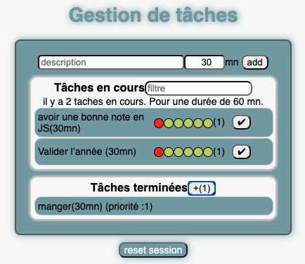
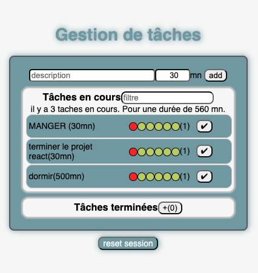
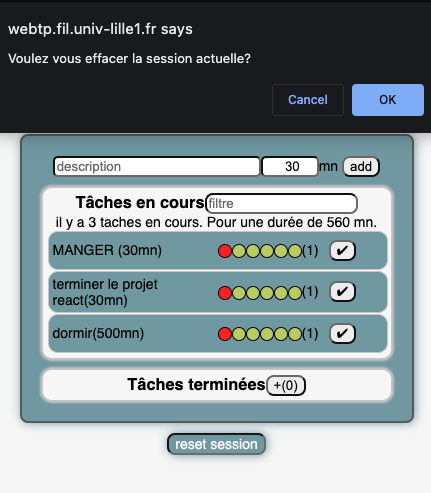
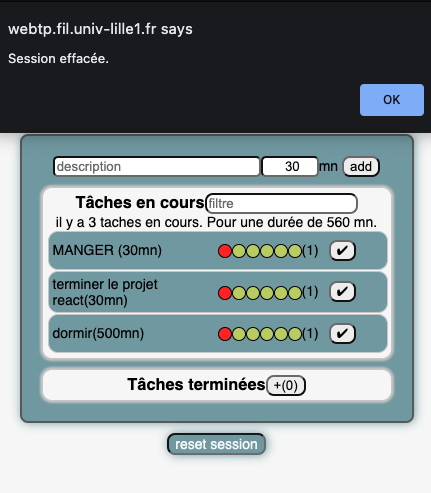

# Projet React : TO-DO list

### Installation et execution de l'application:

-   Commencer par forker le depot.
-   ensuite cloner le projet sur votre depot local.
    -   Pour cela: placer vous dans un dossier de votre choix:
        ```
        $ git clone  https://gitlab-etu.fil.univ-lille1.fr/elkhayari/elkhayari-amevigbe-gaudiere-abbaci-js.git
        ```
-   une fois cloné nous allons nous placer dans le repertoire du jeu avec la commande:
    ```console
        $ cd elkhayari-amevigbe-gaudiere-abbaci-js/projet-react
    ```
-   installation des modules nécessaires:

    ```console
        $ npm install
    ```

-   ensuite il faut générer le `/dist` :

    ```console
        $ npm run build
    ```

-   pour executer l'application de tâches il faut ouvrir `/dist/index.html` :

    -   Linux :

    ```console
        $ xdg-open dist/index.html
    ```

    -   MacOs :

    ```console
        $ open dist/index.html
    ```

    -   Windows (cmd) :

    ```console
        $ dist/index.html
    ```

-   Ou bien on peut initialiser un serveur de développement qui va ouvrir automatiquement le `/dist/index.html` :

```console
    $ npm run dev-server
```

## TO-DO list

#### Cliquez ici ouvrir l’application (avec le vpn activé): [todo-app](https://webtp.fil.univ-lille1.fr/~elkhayari/projet-react/dist/index.html)

L'application réalisé permet la gestion de tâches définies par une durée et auxquelles il est possible d'attribuer une priorité. On distingue les tâches à réaliser de celles déjà terminées.

<div style="text-align:center">

</div>

### Options rajoutés
Nous avons réalisé la gestion des tâches avec le module localStorage
cela permet personnaliser les tâches d'un utilisateur.

Nous avons aussi rajouté un bouton qui nous permet de réinisialiser la session, c'est-à-dire, vider le localStorage.

<div style="text-align:center">
    



    
</div>


### Sources

Pour utiliser localStorage on a effectué une documentation sur le site : [devloper.mozilla.org](https://developer.mozilla.org/fr/docs/Web/API/Storage)
 
